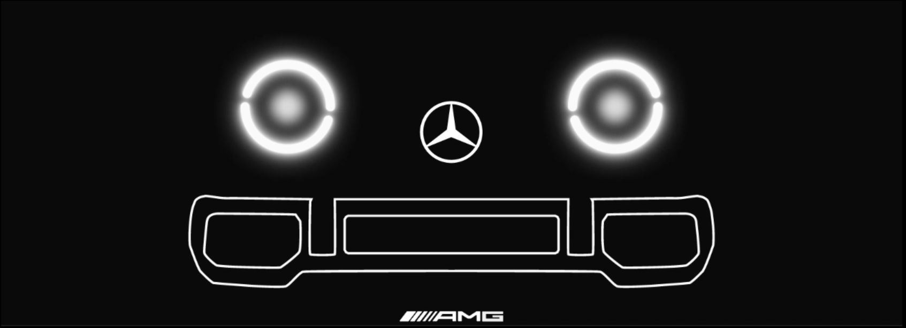
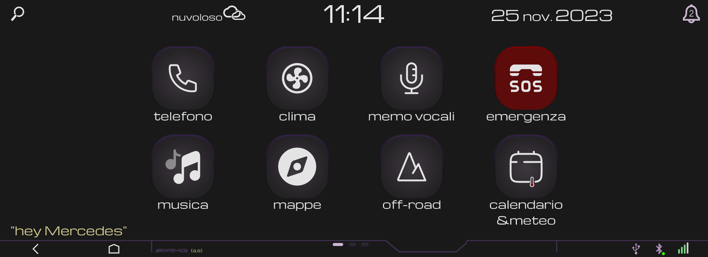

# Mercedes_display_interface
## A project for a concept design of a Mercedes touch screen display interface. 

*To visualise the final result download the **"mercedes_display_interface_HCI.fig"** file and import it in a figma web page or in figma for desktop*

The main goal of this project was to create a slick design of a display interface for a G-class AMG Merceds aiming to achieve a pleasent to the eye product with great features and good "in-car" usability.

